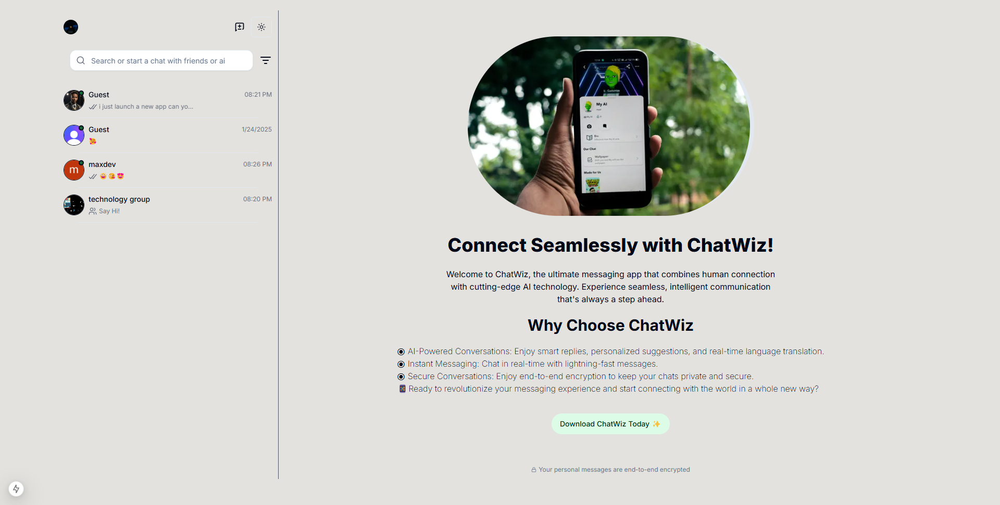
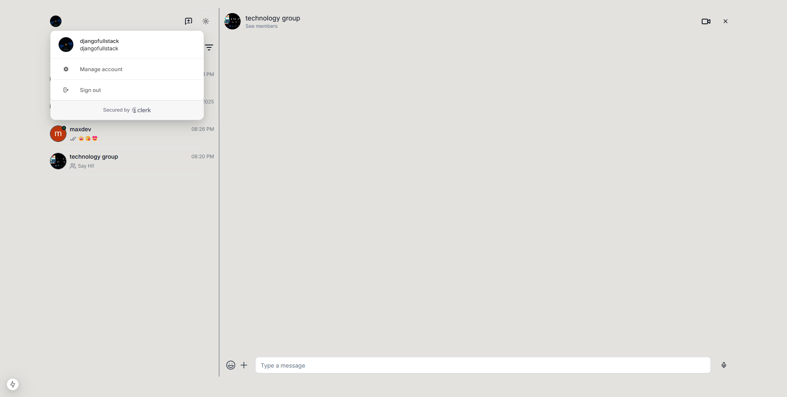
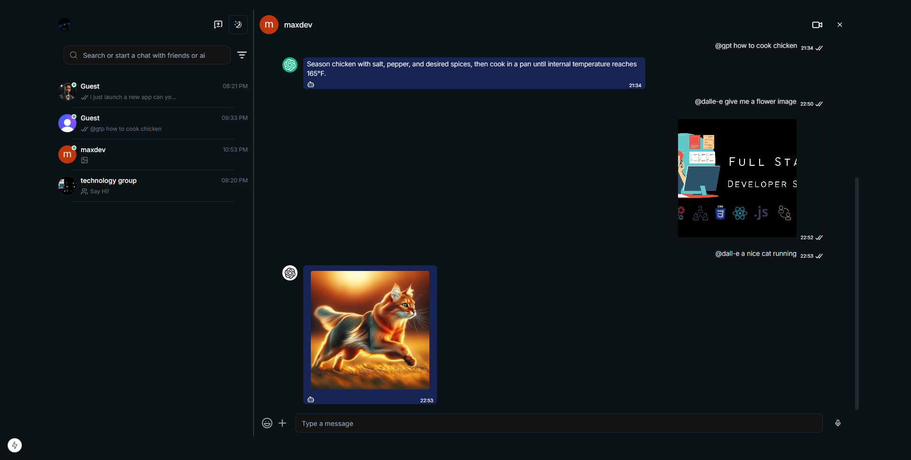
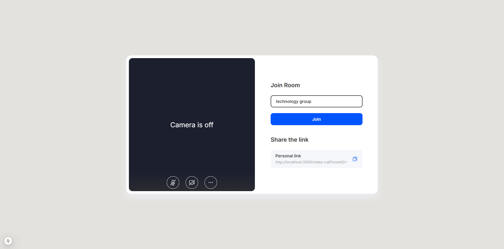

# ChatWiz AI

<h1>ChatWiz AI Project Overview</h1>

This project is about to ChatWiz, the ultimate chat app that combines human connection with advanced AI technology. Designed for seamless, secure, and smart communication, ChatGenius takes your messaging experience to the next level. Chat in real-time, enjoy AI-powered features like smart replies and language translation, and stay connected with your world, effortlessly. Ready for some fun? Dive into awesome, AI-powered conversations with ChatWiz. Tap the button below and let's get chatting with friends, family, and our super cool AI buddy!

###
<h1></h1>
<h1>HomeScreen</h1>

###
<h1></h1>
<h1>Key Features</h1>
<h2>Authentication: Clerk</h2>

###
<h1></h1>
<h2>Chat Features: Private chats group chats, online/offline status</h2>

###
<h1></h1>
<h2>AI Integration: ChatGPT and DALL-E-3 </h2>

###
<h1></h1>
<h2>Multimedia Video calls (private & group)</h2>

 send images and videos manually or by ai Advanced: WebHooks, Light/Dark Mode

###

# 💻 Tech Use:

A feature-rich WhatsApp clone built with the following tech stack

        

  

<picture>
  <source media="(prefers-color-scheme: dark)" srcset="https://raw.githubusercontent.com/tobiasmeyhoefer/tobiasmeyhoefer/output/github-snake-dark.svg" />
  <source media="(prefers-color-scheme: light)" srcset="https://raw.githubusercontent.com/tobiasmeyhoefer/tobiasmeyhoefer/output/github-snake.svg" />
  
</picture>

